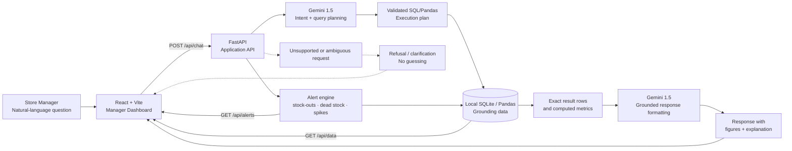

# ClearCart

> **Retail Sales and Inventory Copilot** — a grounded AI assistant that helps retail store managers make fast, accurate decisions from local sales and inventory data.

[](https://www.python.org/)
[](https://fastapi.tiangolo.com/)
[](https://react.dev/)
[](https://tailwindcss.com/)
[](https://ai.google.dev/)

ClearCart is designed for a simple operational reality: a store manager has plenty of data, but very little time. Instead of forcing managers to cross-reference spreadsheets manually—or trusting a conversational model to guess—ClearCart places a strict, data-grounded intelligence layer over a store’s local sales and inventory records.

The manager asks a question in plain language. ClearCart identifies the request, executes deterministic SQL/Pandas logic against the local dataset, and asks the language model to formulate an answer using only the returned figures. When a request is ambiguous, unsupported, or not represented in the available data, the system stops and explains what it cannot answer.

---

## Table of Contents

- [Why ClearCart](#why-clearcart)
- [What the Product Does](#what-the-product-does)
- [Core Features](#core-features)
- [Architecture](#architecture)
- [No-Hallucination Data Flow](#no-hallucination-data-flow)
- [Technology Stack](#technology-stack)
- [Data Model](#data-model)
- [API Surface](#api-surface)
- [Project Structure](#project-structure)
- [Getting Started](#getting-started)
- [Using the Demo](#using-the-demo)
- [Grounding and Safety Rules](#grounding-and-safety-rules)
- [Hackathon Demo Script](#hackathon-demo-script)
- [Evaluation Highlights](#evaluation-highlights)
- [Limitations and Assumptions](#limitations-and-assumptions)
- [Roadmap](#roadmap)
- [Team](#team)
- [License](#license)

---

## Why ClearCart

Retail managers often need answers to questions such as:

- Which products are close to a stock-out?
- What is selling faster than usual?
- Which items are sitting in inventory without meaningful sales?
- What should be reordered first?

The underlying information may already exist in sales reports and stock sheets, but it is scattered across tables and difficult to interpret under time pressure. ClearCart addresses three connected problems:

| Operational problem | Risk | ClearCart response |
|---|---|---|
| Data overload | Managers spend time manually reconciling reports. | A single dashboard combines inventory health, sales activity, and natural-language querying. |
| LLM hallucination | A confident but incorrect number can lead to a poor purchasing decision. | Every answer is grounded in deterministic database output and must cite the figures used. |
| Reactive stock management | A stock-out is discovered only after it disrupts operations. | Proactive alerts surface critical stock, dead stock, and unusual sales movement before the manager asks. |

## What the Product Does

ClearCart combines a responsive manager dashboard with a FastAPI backend and a local data engine. The system supports two complementary workflows:

1. **Ask:** The manager asks a question in natural language and receives a concise, evidence-based response.
2. **Observe:** The dashboard proactively highlights inventory and sales signals that deserve attention.

This combination makes ClearCart more than a chatbot. It is an operational copilot that connects conversational access to measurable store data.

## Core Features

### Grounded data-to-text answers

ClearCart does not ask the language model to invent or estimate business metrics. The backend first obtains the relevant values from local SQLite/Pandas data, then uses those exact values to produce the final explanation.

### Strict refusal and escalation

If a manager asks about information outside the available sales and inventory data—such as employee payroll—the assistant explicitly refuses to guess and identifies the boundary of its knowledge. Unsupported requests are treated as a safety condition, not as an invitation to improvise.

### Proactive dashboard alerts

The frontend can display actionable signals before a question is asked, including likely stock-outs, dead stock, and unusual sales spikes. This supports a faster morning review and helps managers prioritize attention.

### Ambiguity handling

When the system cannot confidently determine which product or metric a manager means, it asks for clarification instead of selecting an arbitrary interpretation.

### Missing-data transparency

If a product exists but has no sales history for the requested period, ClearCart reports that sales data is unavailable. It does not silently convert missing history into a zero or fabricate a trend.

### Single-command execution

The application is designed to run as one integrated service. FastAPI serves the backend and the built React frontend from port `8000`, making the project easy to demonstrate during a hackathon.

## Architecture

The system separates **language understanding**, **deterministic data execution**, and **response presentation**. The language model may help interpret intent and format a response, but the local data layer remains the source of truth for numerical values.



For a standalone version of the diagram, see [`docs/architecture.mmd`](docs/architecture.mmd) if the file is copied into the repository.

## No-Hallucination Data Flow

The critical query path is intentionally staged:

| Stage | Responsibility | Grounding rule |
|---|---|---|
| 1. Capture | Receive the manager’s natural-language question. | Preserve the original question for traceability. |
| 2. Interpret | Identify the intended metric, product, period, or alert type. | Ask for clarification when the request is ambiguous. |
| 3. Execute | Run deterministic SQL/Pandas logic against the local data. | Numerical results must come from the data layer. |
| 4. Validate | Confirm that the result contains the required fields and usable values. | Missing history remains explicitly missing. |
| 5. Explain | Format a manager-friendly answer using the returned result. | The answer must cite the exact figures used. |
| 6. Escalate | Refuse or redirect unsupported requests. | Never guess outside the supported data domain. |

This architecture preserves the strengths of an LLM—natural-language interaction and readable explanations—without delegating business arithmetic to an unconstrained generative response.

## Technology Stack

| Layer | Technology | Role in ClearCart |
|---|---|---|
| Frontend | React + Vite | Provides the fast, responsive manager dashboard. |
| Styling | Tailwind CSS | Supplies a clean utility-first visual system for the interface. |
| Backend | FastAPI on Python 3.11+ | Serves the API, hosts the built frontend, and coordinates query execution. |
| AI layer | Gemini 1.5 API | Supports intent extraction and grounded response formulation. |
| Data layer | SQLite + Pandas | Enables local, deterministic querying and data transformations. |
| Source data | CSV files | Provides portable mock product, inventory, and sales records. |

## Data Model

The demo dataset is stored in the `data/` directory and is intentionally shaped to exercise the product’s decision-support behavior.

| File | Purpose | Example responsibilities |
|---|---|---|
| `data/products.csv` | Product catalog | Product names, categories, and optimal reorder thresholds. |
| `data/inventory.csv` | Current inventory state | On-hand quantities and deliberately seeded critical stock conditions. |
| `data/sales.csv` | Recent transaction history | A 30-day sales log containing spikes and seasonal drops for analysis. |

A typical analytical join connects product identity across the three tables, compares current inventory against reorder thresholds, and aggregates recent sales into manager-facing signals.

## API Surface

| Method | Endpoint | Access | Description |
|---|---|---|---|
| `GET` | `/` | Public | Serves the main ClearCart dashboard. |
| `POST` | `/api/chat` | Internal | Accepts a manager question and returns a grounded response. |
| `GET` | `/api/alerts` | Internal | Returns proactive stock and sales alerts. |
| `GET` | `/api/data` | Internal | Returns raw or prepared table data for frontend visualizations. |

### Example chat request

```bash
curl -X POST http://localhost:8000/api/chat \
  -H "Content-Type: application/json" \
  -d '{"message":"What is running out?"}'
```

The exact JSON response shape should be treated as implementation-defined by the backend. A production version should expose a stable response contract containing the answer, supporting figures, query status, and any clarification or refusal state.

## Project Structure

```text
ClearCart/
├── app.py                         # Main FastAPI entry point; serves port 8000
├── requirements.txt               # Python dependencies
├── README.md                      # Project documentation
├── data/                          # Grounding data
│   ├── products.csv               # Catalog and reorder thresholds
│   ├── inventory.csv              # Current stock levels
│   └── sales.csv                  # Recent transaction history
├── src/                           # Backend domain logic
│   ├── ai_agent.py                # Gemini constraints and refusal logic
│   └── database.py                # SQLite/Pandas execution layer
└── frontend/
    ├── dist/                      # Built React files served by FastAPI
    └── src/                       # React components and Tailwind styles
```

## Getting Started

### Prerequisites

Install the following before running the application:

- Python `3.11` or later.
- A Gemini API key with access to the model configured by the project.
- Node.js and the project’s frontend tooling if you need to rebuild the React interface from source.

### 1. Clone the repository

Replace the placeholder URL with the repository URL used for your hackathon submission.

```bash
git clone https://github.com/your-username/ClearCart.git
cd ClearCart
```

### 2. Install backend dependencies

```bash
python -m venv .venv
source .venv/bin/activate        # Windows PowerShell: .venv\Scripts\Activate.ps1
pip install -r requirements.txt
```

### 3. Configure the Gemini API key

macOS/Linux:

```bash
export GEMINI_API_KEY="your_api_key_here"
```

Windows Command Prompt:

```bat
set GEMINI_API_KEY="your_api_key_here"
```

For local development, prefer a private `.env` workflow supported by the implementation. Do not commit API keys to Git, screenshots, or public issue reports.

### 4. Start ClearCart

```bash
python app.py
```

Open [http://localhost:8000](http://localhost:8000) in a browser. The FastAPI service should initialize the local data layer, mount the built frontend, and expose the complete application through the single port.

### 5. Optional frontend development workflow

If the repository includes a frontend package configuration and you want to modify the React source, install the frontend dependencies and rebuild the static bundle according to the scripts defined in `frontend/package.json`. The generated files should be placed in `frontend/dist/` so that `app.py` can serve them.

## Using the Demo

A strong first run follows this sequence:

1. Open the dashboard and review the proactive alerts.
2. Ask, **“What is running out?”** to demonstrate stock-out detection.
3. Ask for a product’s recent performance to demonstrate grounded sales analysis.
4. Ask about a product with no sales history to demonstrate transparent missing-data handling.
5. Ask an out-of-scope question, such as employee payroll, to demonstrate refusal and escalation.
6. Ask an ambiguous question and show that the system requests clarification rather than guessing.

The ideal demo emphasizes not only what ClearCart answers, but also what it deliberately refuses to invent.

## Grounding and Safety Rules

ClearCart’s trust model is built around explicit boundaries:

| Situation | Expected behavior |
|---|---|
| The product and metric are clear, and data exists. | Execute the data query and return a grounded answer with figures. |
| The product or intent is ambiguous. | Ask a clarifying question before querying. |
| The product exists but the period has no sales history. | State that no sales data is available for the period. |
| The request is outside sales and inventory scope. | Refuse to guess and explain the supported scope. |
| The data layer returns no matching record. | Report that no matching data was found rather than fabricating a result. |

This behavior is especially important for operational decisions, where a plausible-sounding answer can be more dangerous than an explicit limitation.

## Hackathon Demo Script

### 30-second pitch

> ClearCart is a retail sales and inventory copilot that turns a store manager’s local data into fast, actionable decisions. It combines proactive alerts with a natural-language assistant, but unlike a generic chatbot, it never invents business numbers: every answer is generated from exact SQLite/Pandas results, and unsupported questions are refused transparently.

### Suggested live walkthrough

| Time | Demonstration | Message to judges |
|---:|---|---|
| 0:00–0:30 | Show the dashboard and alert cards. | ClearCart identifies operational priorities before the manager asks. |
| 0:30–1:15 | Ask “What is running out?” | Natural language is converted into a deterministic data operation. |
| 1:15–1:45 | Open the related data or supporting figures. | The response is traceable to actual rows and values. |
| 1:45–2:15 | Ask about missing history or an ambiguous product. | The system is transparent about uncertainty and missing data. |
| 2:15–2:45 | Ask about employee payroll. | ClearCart refuses unsupported requests instead of hallucinating. |
| 2:45–3:00 | Close with the roadmap. | The foundation can grow into procurement automation and multi-store intelligence. |

## Evaluation Highlights

ClearCart is designed to score well in a hackathon review because it demonstrates a complete loop from user problem to working technical solution:

- **Clear user value:** The product targets a concrete retail workflow—inventory attention and sales interpretation.
- **Responsible AI design:** The LLM is constrained by a deterministic local data layer and explicit refusal logic.
- **End-to-end implementation:** The project includes a React interface, FastAPI service, local dataset, API routes, and a single-command launch path.
- **Strong demoability:** Seeded stock-outs, sales spikes, seasonal drops, missing history, and unsupported questions make the behavior easy to demonstrate.
- **Practical extensibility:** The roadmap naturally leads to supplier ordering, multi-store comparison, and seasonality forecasting.

## Limitations and Assumptions

This hackathon version is intentionally focused on a local, single-store demonstration. It assumes CSV-based data, a locally available SQLite/Pandas execution layer, a configured Gemini API key, and a pre-built frontend bundle. It does not yet provide authentication, role-based access, supplier-system integrations, multi-store synchronization, or a production-grade forecasting pipeline.

The README describes the intended contract and architecture from the supplied project brief. If the implementation changes endpoint names, environment variables, or response schemas, update this document alongside the code so that the repository remains reproducible for judges and contributors.

## Roadmap

| Phase | Capability | Outcome |
|---|---|---|
| Phase 2 | Automated procurement | Draft supplier orders or emails when a stock-out is identified. |
| Phase 3 | Multi-store support | Compare inventory health across physical store locations. |
| Phase 4 | Predictive seasonality | Forecast expected seasonal changes before the relevant period begins. |

## Team

**Solo Developer — Full Stack & AI Integration**

ClearCart was designed and built by a solo developer representing **KSR College of Engineering**, covering the manager dashboard, React/Tailwind frontend, FastAPI backend, local SQLite/Pandas data pipelines, prompt engineering, grounded Text-to-SQL behavior, and escalation fallbacks.

## License

Add the project’s chosen license here before public submission. For example, a hackathon repository may use the MIT License by adding a `LICENSE` file and replacing this section with a link to it.

---

## References

This README was prepared from the supplied ClearCart project brief, `ClearCart_README.pdf`, which documents the product concept, architecture, routes, data files, technology stack, setup flow, and roadmap.

- [1]: ClearCart project brief (provided attachment: `ClearCart_README.pdf`)

